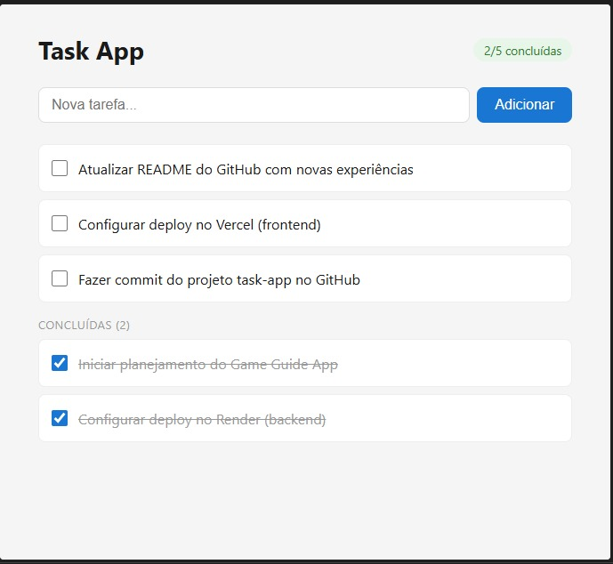

# Task App — Fullstack CRUD

Aplicação fullstack de gerenciamento de tarefas com React, Node.js, Express e PostgreSQL.


---

## Screenshot



---

## Sobre o projeto

Esse foi meu primeiro projeto fullstack construído do zero — sem seguir uma videoaula passo a passo ou copiar código de uma aula. A ideia era sair do modo "máquina" e realmente entender o que estava fazendo.

A parte mais difícil foi colocar em prática conhecimentos que eu só tinha visto de forma passiva. Muitos dos meus projetos anteriores eram cópias de aulas, então aqui eu precisei pensar por conta própria em cada decisão.

O que aprendi de verdade: como linkar frontend com backend, como resolver bugs no terminal de forma consciente, e como cada camada da aplicação se comunica com a outra.

---

## Funcionalidades

- Criar, listar, editar e deletar tarefas (CRUD completo)
- Marcar tarefas como concluídas
- Edição inline com duplo clique
- Separação visual de tarefas pendentes e concluídas
- Tratamento de erros e loading states
- API REST com Node.js + Express

---

## Tecnologias

| Camada     | Tecnologia                        |
|------------|-----------------------------------|
| Front-end  | React 18, Vite                    |
| Back-end   | Node.js, Express                  |
| Banco      | PostgreSQL                        |
| Estilização| CSS puro                          |

---

## Estrutura do projeto

```
task-app/
├── backend/
│   └── src/
│       ├── config/
│       │   ├── database.js       # Conexão com PostgreSQL
│       │   └── schema.sql        # Script de criação da tabela
│       ├── controllers/
│       │   └── taskController.js # Lógica de cada rota
│       ├── models/
│       │   └── taskModel.js      # Queries SQL
│       ├── routes/
│       │   └── taskRoutes.js     # Definição das rotas
│       └── server.js             # Entrada da aplicação
│
└── frontend/
    └── src/
        ├── components/
        │   ├── TaskForm.jsx       # Input de nova tarefa
        │   ├── TaskItem.jsx       # Item individual com edição
        │   └── TaskList.jsx       # Lista com separação pendente/concluída
        ├── hooks/
        │   └── useTasks.js        # Gerenciamento de estado
        ├── services/
        │   └── api.js             # Chamadas à API
        ├── App.jsx
        └── App.css
```

---

## Como rodar localmente

### Pré-requisitos

- Node.js 18+
- PostgreSQL instalado e rodando

### 1. Clone o repositório

```bash
git clone https://github.com/R15N-eng/Task---App.git
cd Task---App
```

### 2. Configure o banco de dados

```bash
# Acesse o PostgreSQL
psql -U postgres

# Execute os comandos
CREATE DATABASE taskapp;
\c taskapp
CREATE TABLE tasks (
  id SERIAL PRIMARY KEY,
  title VARCHAR(255) NOT NULL,
  completed BOOLEAN DEFAULT FALSE,
  created_at TIMESTAMP DEFAULT NOW()
);
```

### 3. Configure as variáveis de ambiente

```bash
cd backend
cp .env.example .env
# Edite o .env com sua senha do PostgreSQL
```

### 4. Inicie o backend

```bash
cd backend
npm install
npm run dev
# API rodando em http://localhost:3001
```

### 5. Inicie o frontend

```bash
cd frontend
npm install
npm run dev
# App rodando em http://localhost:5173
```

---

## Rotas da API

| Método | Rota          | Descrição               |
|--------|---------------|-------------------------|
| GET    | /tasks        | Listar todas as tarefas |
| GET    | /tasks/:id    | Buscar tarefa por ID    |
| POST   | /tasks        | Criar nova tarefa       |
| PUT    | /tasks/:id    | Atualizar tarefa        |
| DELETE | /tasks/:id    | Deletar tarefa          |

---

## Próximos passos

- [ ] Autenticação com JWT (login por usuário)
- [ ] Deploy (Vercel + Render)
- [ ] Filtros e busca por título
- [ ] Testes com Jest

---

## Autor

**Raimundo Nonato** — [LinkedIn](https://linkedin.com/in/raimundononato-eng) · [GitHub](https://github.com/R15N-eng)